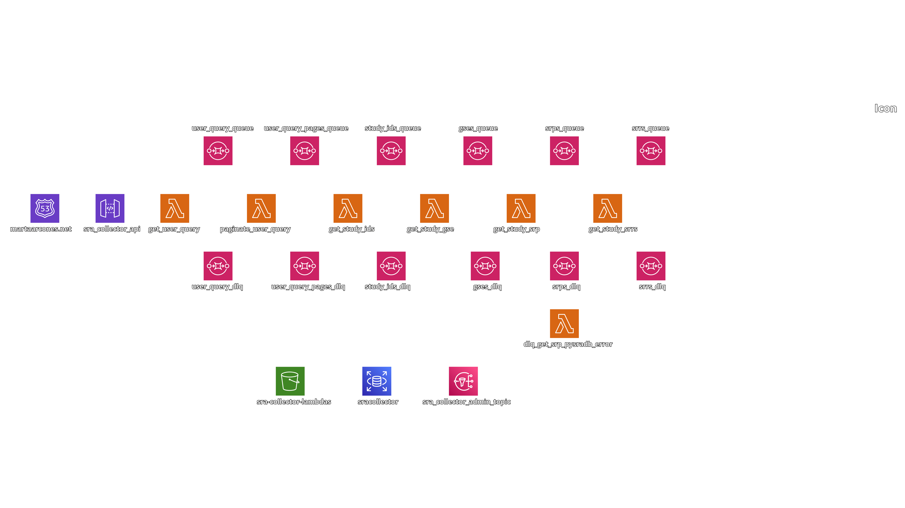

# sra-collector

  

Collect [NIH NCBI](https://www.ncbi.nlm.nih.gov) **SRA** 🧬 metadata of several **GDS** studies in one search 🔮

Use the API directly 👉 [here](https://arcones.github.io/sra-collector/)

> 📢 **Best Effort Design**
>
> NCBI data is sometimes not consistent, therefore, **sra-collector** implements _best effort_ approach, fetching all possible SRA metadata but not giving any guarantees.
>
> Users will be able to check failure reports of each query.

## Infra Diagram

## Database Diagram

## Tech Stack

## Style Patterns
- Cloud Native
- Infrastructure As Code
- Asynchronous Communication
- Fail Fast
- Immutable Infrastructure
- Convention Over Configuration
- Encryption
- Passwords Secure Storage
- Continuous Integration & Deployment
- Git Ops
- Don't Repeat Yourself
