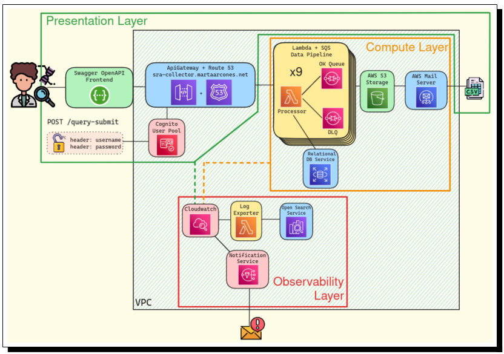
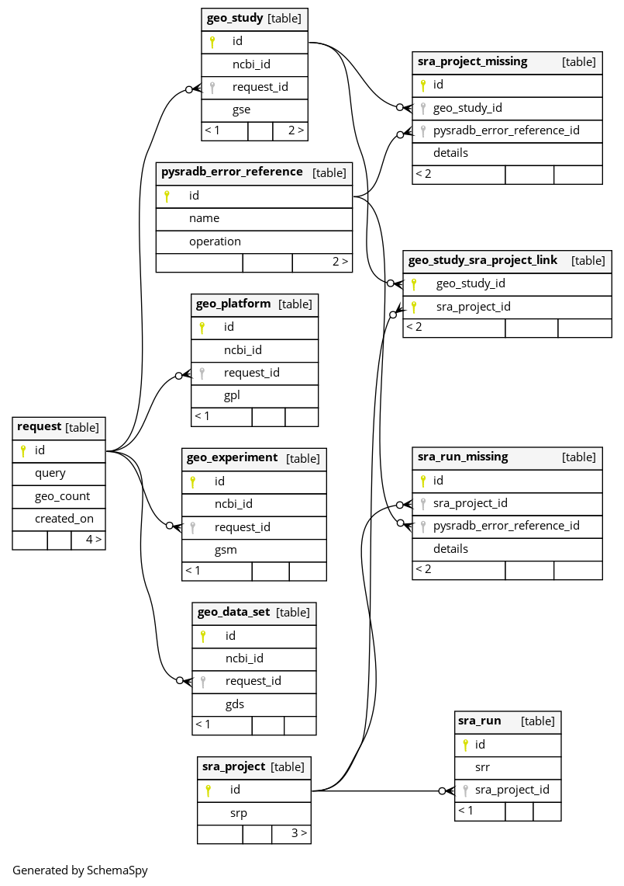

$${\color{red}📢 Deprecation Notice}$$
> Due to the lack of sponsors, the project is discontinued as its cloud expenses are not affordable.
> An alternative in the form of a CLI is being considered.
> Contact by mail ✉️ to **marta.arcones@gmail.com** in case you are interested in project continuity.

# SRA-Collector

  

Collect [NIH NCBI](https://www.ncbi.nlm.nih.gov) 🧬 metadata of several **NCBI** studies in one search 🔮. The system will provide the following stats in a CSV file of **all the experiments** related to **all the studies** fetched by the GEO search:

* **NCBI Study ID**: text field containing the study identifier fetched by the text query in NCBI database.
* **GSE**: text field containing the GEO identifier for each NCBI study.
* **SRP**: text field containing the SRA project identifier relative to the GEO entity.
* **SRR**: text field containing the SRA run identifier for each SRP entity.
* **Spots**: integer number representing the sequencing depth of the SRR.
* **Bases**: integer number representing the amount of sequenced bases in the SRR.
* **Organism**: text field containing from which species the SRR was obtained.
* **Layout**: text field containing one of the two possibles sequencing strategies, i.e., single or paired.
* **Phred Score From 30**: float number field showing the percentage of reads above a phred score of 30. In other words, this value shows the percentage of reads with an accuracy of 99.9 %.
* **Phred Score From 37**: float number field showing the percentage of reads above a phred score of 37. Accordingly, this value shows the percentage of reads with an accuracy of 99.98 %.
* **Read 0 Count**: integer number field representing the count of reads in the main read direction.
* **Read 0 Average**: float number field representing the average sequence length for the main read direction.
* **Read 0 Stdev**: float number field representing the standard deviation of the sequence length average in the main direction.
* **Read 1 Count**: integer number field representing the count of reads in the reverse read direction. This field will be filled only in paired layout samples as those require both reads.
* **Read 1 Average**: float number field representing the average sequence length for reverse read direction.
* **Read 1 Stdev**: float number field representing the standard deviation of the sequence length average in the reverse read direction.

## Use Case Example

For the query `hypercholesterolemia and rna seq` that can be done in [NIH NCBI](https://www.ncbi.nlm.nih.gov) in their web:

> https://www.ncbi.nlm.nih.gov/gds/?term=hypercholesterolemia+and+rna+seq

The query retrieves, at the moment of writing, 25 studies. If the query instead is done in `sra-collector` system, it will be able to generate a CSV report like [this one](./docs/Report_bhBZZgrvliAEMcw=.csv) containing the statistics for all the experiments related to all the studies found by NCBI.

## Full Project Documentation

Find it 👉 [here](./docs/TFG_MartaArconesRodriguez_Final.pdf).

## General Product & Infra Diagram

## Database Diagram

## Tech Stack

