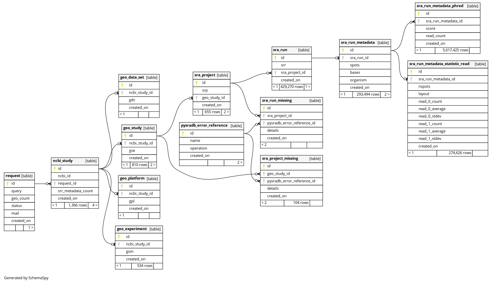

# sra-collector

Collect NIH SRA metadata of several studies in one search.

Use the API directly in [here](https://arcones.github.io/sra-collector/)

## Infra Diagram

## Database Diagram

## Tech Stack

## TODO After MVP phase
- Write about the best effort nature of the project
